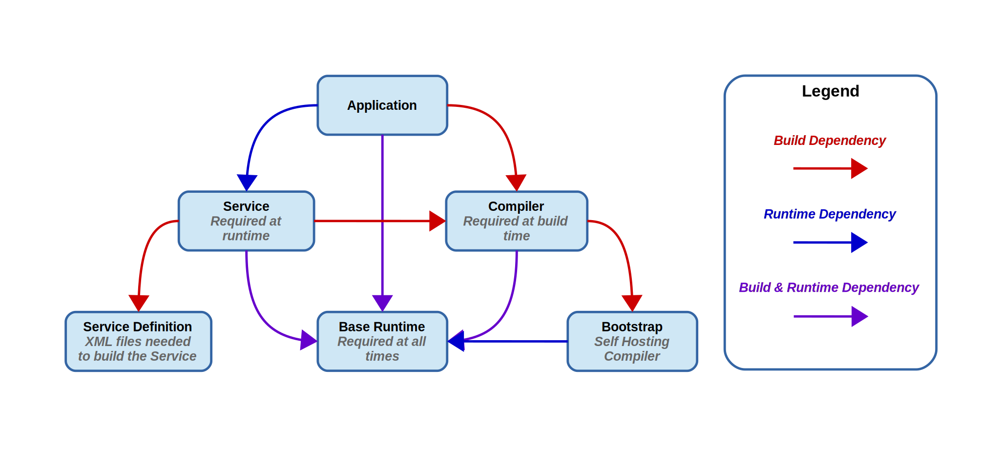

..
   Licensed under the Apache License, Version 2.0 (the "License");
   you may not use this file except in compliance with the License.
   You may obtain a copy of the License at

       http://www.apache.org/licenses/LICENSE-2.0

   Unless required by applicable law or agreed to in writing, software
   distributed under the License is distributed on an "AS IS" BASIS,
   WITHOUT WARRANTIES OR CONDITIONS OF ANY KIND, either express or implied.
   See the License for the specific language governing permissions and
   limitations under the License.

Dependency model
================
Elements in the data model are related by their *dependencies*. In BuildStream, there
are two types of relationship that an Element may have with a *dependency*,
:ref:`build and runtime dependencies <format_dependencies>`. More often than not,
an element will require its dependency both to *build* and also at *runtime*.

Consider a simple build scenario where you want to build an application, which
requires a service be present in order to function properly at *runtime*, a
compiler that need only be present at *build time*, and a runtime environment
or base system which must be required all the time:

Note that in BuildStream we are only concerned with element level granularity
in our dependency model, and there is no way to depend on only a part of an element's
output *artifact*. Instead we can employ :mod:`compose <elements.compose>` and
:mod:`filter <elements.filter>` elements in conjunction with :ref:`split rules <public_split_rules>`
to achieve sub artifact granularity at build and deploy time.

When developing BuildStream, it is important to understand the distinction
between dependency types and element :class:`Scope <buildstream.types.Scope>`,
which acts as a selector of which elements to consider in the dependency
graph of a given element when performing recursive activities.

Scope
~~~~~

* **Scope.ALL**

  In the :func:`Scope.ALL <buildstream.types.Scope.ALL>` scope, all elements
  are considered.

  This is used in some cases to forcefully fetch, pull or build all dependencies
  of a given element, even when not all of them are needed.

  This scope simply includes all of the dependencies, including the element itself.

* **Scope.RUN**

  In the :func:`Scope.RUN <buildstream.types.Scope.RUN>` scope, only elements
  which are required to run are considered, including the element itself. Note
  that these are transitive - the service also requires the base runtime.

  This is used when for example, launching a ``bst shell`` environment
  for the purpose of running, or in any case we need to consider which
  elements are required to run.

  .. image:: images/arch-dependency-model-runtime.svg
     :align: center

* **Scope.BUILD**

  In the :func:`Scope.BUILD <buildstream.types.Scope.BUILD>` scope, only
  elements which are required to build are considered, *excluding* the
  element we intend to build.

  .. image:: images/arch-dependency-model-build.svg
     :align: center

  Note that build type dependencies are not transitive, which is why the
  *Bootstrap* element is not selected when pulling in the *Compiler* to
  build the *Application*.

  Further, note that we still follow the *Compiler* dependency on the
  *Base Runtime*, this is because when we depend on an element for the
  purpose of *building*, we expect that element to *run* and as such
  we include all of the *runtime dependencies* of *build dependencies*
  when selecting the *Scope.BUILD* elements.
